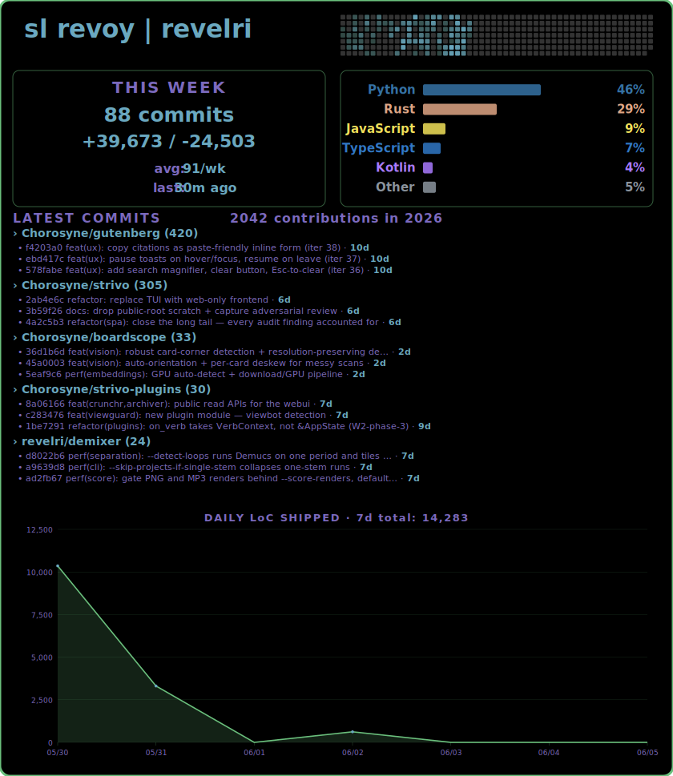

---

<details>
<summary>About this card</summary>

### revelri/revelri

Auto-generated GitHub profile card. Pulls live data from the GitHub API every 30 minutes via GitHub Actions and renders it as an animated SVG.

**What it shows:**
- Contribution heatmap (52 weeks, color-mapped from the [Zeitgeist](https://github.com/revelri/zeitgeist) emotion palette)
- Current and longest contribution streaks
- Language distribution across repos pushed in the last 90 days
- Featured projects from `config.yml`
- ASCII art hero section with metaball color blending and staggered CSS animation

**How it works:**

`generate_cards.py` queries the GitHub GraphQL API via `gh`, aggregates contribution and language data, and fills an SVG template. Rate-limit retry with exponential backoff. Falls back to cached mock data when offline.

The hero section (`generate_hero.py`) renders ASCII art characters with per-character color computed from weighted blending of five emotion color centers — a soft-body field interpolation that produces smooth color transitions across the art. Colors quantize to ~24 steps to keep the CSS compact, with hash-based stagger delays for an organic animation feel.

**Setup for your own:**

```bash
gh auth login
cp config.yml.example config.yml   # edit name, tagline, featured repos
python scripts/generate_cards.py
```

Add the GitHub Actions workflow to auto-update on push and every 30 minutes.

**Stack:** Python 3, GitHub GraphQL API, SVG, CSS animations. Zero external dependencies beyond `gh` CLI.

</details>
